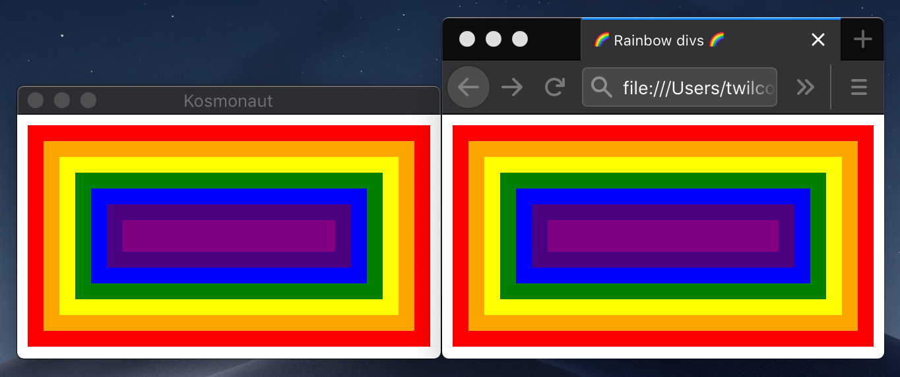

---

 

Kosmonaut is a web browser engine created to serve as the vehicle for your journey across the world wide web.

> The road to the stars is steep and dangerous.  But we're not afraid...space flights can't be stopped.
> 
> ― Yuri Gagarin

### What can Kosmonaut do?

So far, not much.  Only a very limited subset of CSS is currently supported, so most web pages will not work.  However, given very basic HTML and CSS, Kosmonaut does render the right things — see Kosmonaut's rendering of [this code](https://github.com/twilco/kosmonaut/blob/eef5274c252038062049769861d02354cbaa4b2a/web/rainbow-divs-incl-css.html), compared with that of Firefox:

Here is a summary of things Kosmonaut can do, things I'm currently working on, and things that are towards the front of the todo list.

- [x] Parse HTML and small subset of CSS into DOM and rules, cascade CSS and apply to DOM
- [x] Layout and paint of normal flow, non-replaced block-level boxes.
    - [x] Support[1](#f1) for [abstract box layout](https://drafts.csswg.org/css-writing-modes-4/#abstract-layout) with `writing-mode` and `direction` properties
- [x] [Layout-tree-dump snapshot-based testing](https://github.com/twilco/kosmonaut/blob/c1bcb1aa858309e387c6d33e2fa6a698d07839a5/tests/layout/directional/snapshots/lib__layout__directional__ltr_vertical_lr_block_boxes_top_left_right_mbp_applied_physically.snap#L5) and [auto-discovering ref-tests](https://github.com/twilco/kosmonaut/blob/master/tests/lib.rs#L13#L25)
- [x] Support for arbitrary scale factors (e.g. high-DPI monitors)
- [x] Text rendering (without actual integration into layout — see next item)
- [ ] Layout of basic non-replaced inline-level content (such as text)

<b id="f1">1:</b> Orthogonal flows ([see spec](https://drafts.csswg.org/css-writing-modes-4/#orthogonal-flows)) not supported. 
Mixed `writing-mode` support in general (including parallel flows) is currently iffy — I recommend simply using `* { writing-mode: <val> }`. [↩](#a1)

### Project goals

Kosmonaut was created with the intention of learning browser engine development.  However, the project has come a little ways now, and I've been thinking about niches I can work towards fitting Kosmonaut into.  I've shared some thoughts on potential niches [in this issue](https://github.com/twilco/kosmonaut/issues/6), and would love to hear your ideas too. 

### Build and test

Kosmonaut is built with Rust using OpenGL bindings via [gl-rs](https://github.com/brendanzab/gl-rs), [Glutin](https://github.com/rust-windowing/glutin) for window management and OpenGL context creation, Servo's [html5ever](https://github.com/servo/html5ever) and [cssparser](https://github.com/servo/rust-cssparser) for HTML and CSS parsing, and various other auxiliary libraries.

To build from source:

1. Install Rust: https://www.rust-lang.org/tools/install
2. Install native dependencies, most of which are required for FreeType which Kosmonaut uses for text rendering.
    * Windows 10, MacOS
        * Skip this step (Kosmonaut uses [font-kit](https://github.com/servo/font-kit), which uses the native font APIs for Windows and MacOS).
    * Ubuntu
        * Install the dependencies found in [this Dockerfile](docker/Dockerfile-ubuntu) on your machine (the `apt-get install` bit).
    * Arch Linux 
        * Install the dependencies found in [this Dockerfile](docker/Dockerfile-arch) on your machine (the `pacman -Syu` bit).
    * For those running on other operating systems, you'll need to install the equivalent packages.  I'd love to get more documentation on installation for other systems, so open an issue if you have trouble or if you'd like to share your setup process.
3. `cargo build`

To render HTML and CSS with Kosmonaut, either pass files (HTML and optionally CSS):

`cargo run -- tests/websrc/rainbow-divs.html`

or a URL:

`cargo run -- https://twilco.github.io/assets/html/rainbow-divs.html`

To run the tests, both unit and layout, execute:

`cargo test --all`

For layout tests, Kosmonaut transforms the given HTML and CSS into a box tree, lays it out, and dumps it as text.  Those text snapshots are verified with [insta](https://docs.rs/insta/latest/insta/index.html).

If you need to review / update layout snapshots, it is helpful to install the Cargo insta CLI tool like so:

`cargo install cargo-insta`

Kosmonaut can also run ref-tests.  Ref-tests render two HTML files and compares the result pixel-by-pixel, ensuring they are the same.
This is useful in lots of scenarios, such as testing that shorthands render the same as their longhand equivalents.
 
### License and credits

Kosmonaut's current implementation is heavily inspired by [Servo](https://github.com/servo/servo), sometimes taking code directly from it.  Thus, Kosmonaut is licensed with the [Mozilla Public License 2.0](https://www.mozilla.org/en-US/MPL/2.0/).

Kosmonaut also takes inspiration from [Robinson](https://github.com/mbrubeck/robinson).  Thanks to [mbrubeck](https://github.com/mbrubeck) for their great series of articles on browser engines.

Finally, Kosomonaut's DOM implementation was taken from [Kuchiki](https://github.com/kuchiki-rs/kuchiki) and has been slightly modified to fit our needs.
